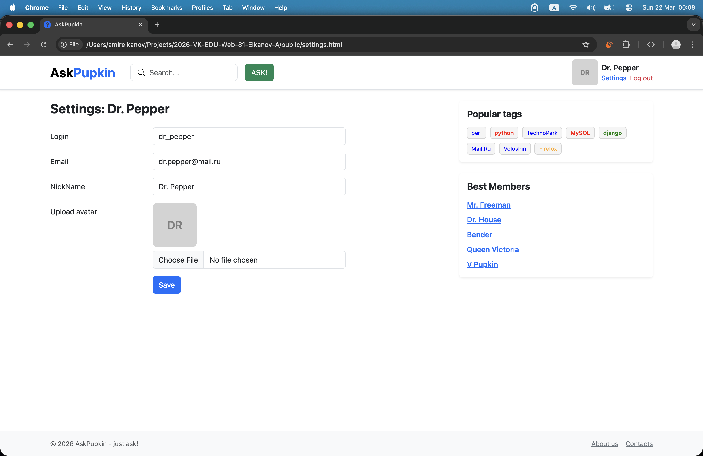

# AskPupkin - just ask!

## Начало работы

На данный момент проект представляет из себя статические html-страницы без какой-либо логики, поэтому для запуска проекта достаточно открыть в браузере `index.html`. Навигация между другими статическими страницами _(кроме `base.html` - это заготовка на будущее)_ предусмотрена.

## Страницы

### Страница листинга вопросов

### Страница добавления вопроса

### Страница одного вопроса

### Страница пользователя с настройками

### Форма авторизации

### Форма регистрации

Также есть `base.html`, который содержит в себе основную верстку любой страницы этого проекта. На месте вставляемого контента в данный момент просто написано CONTENT.
