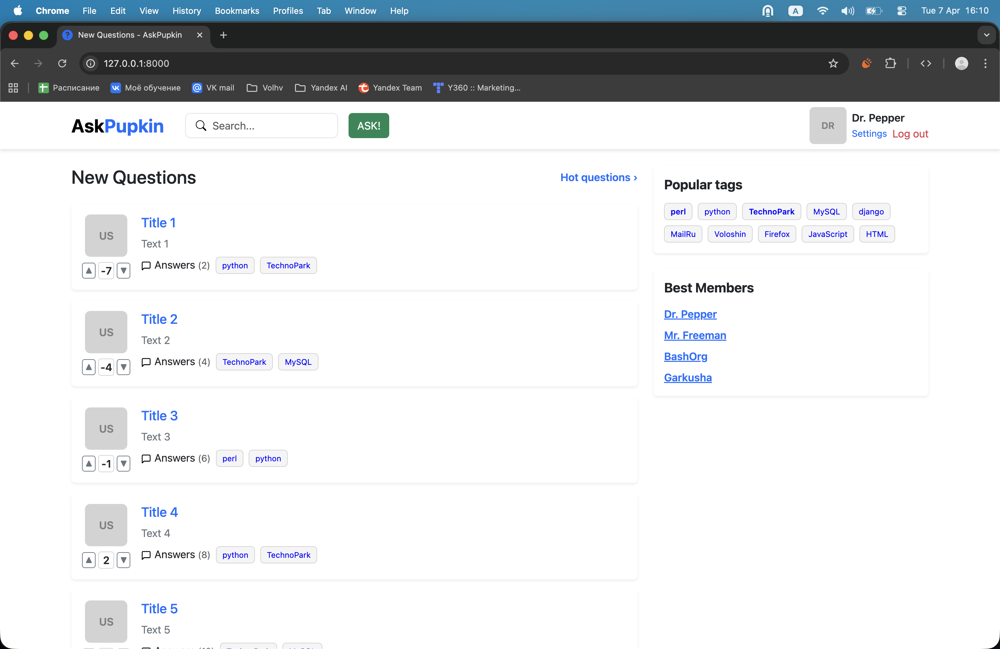
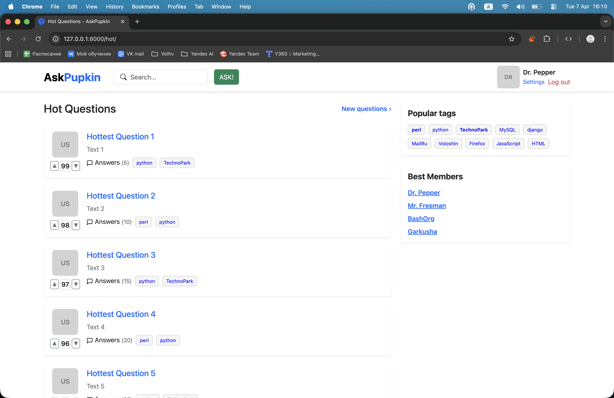
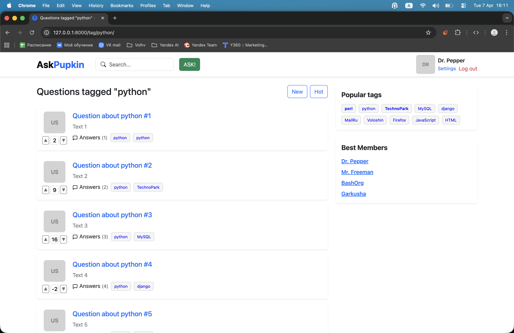
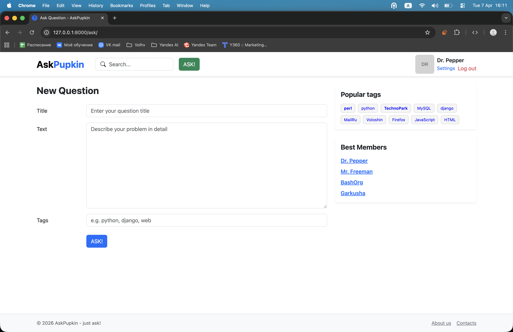
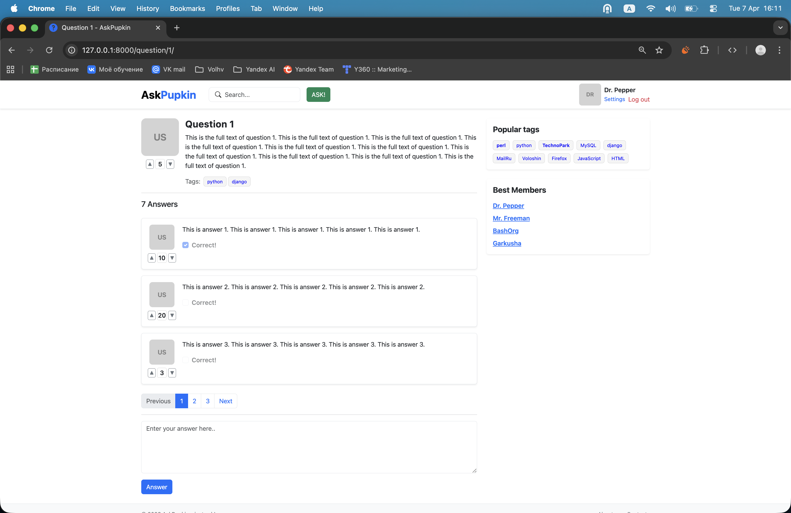
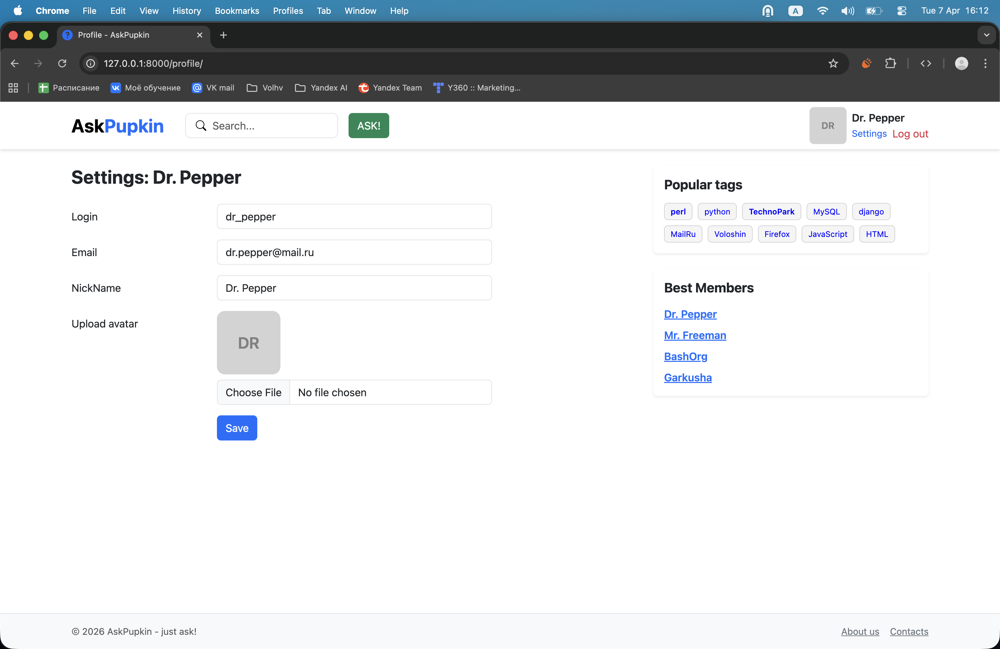
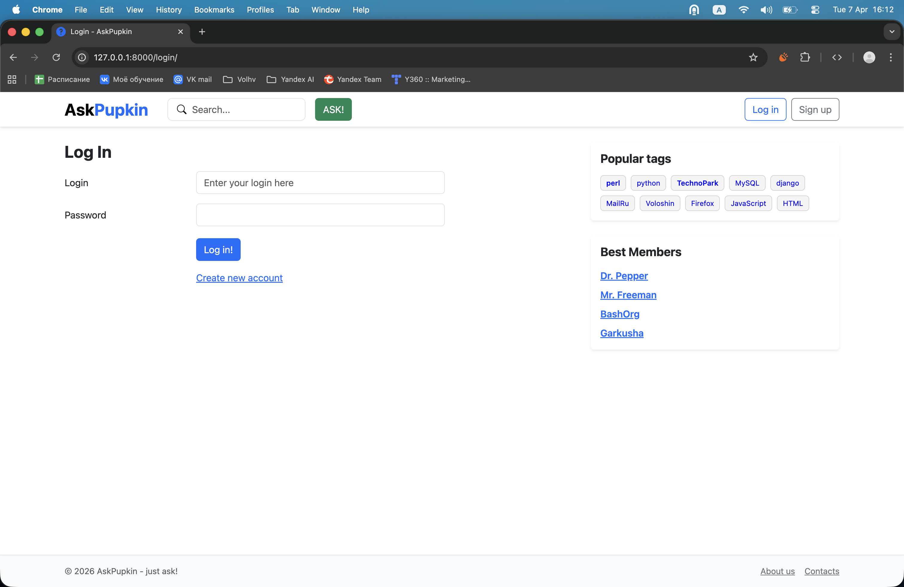
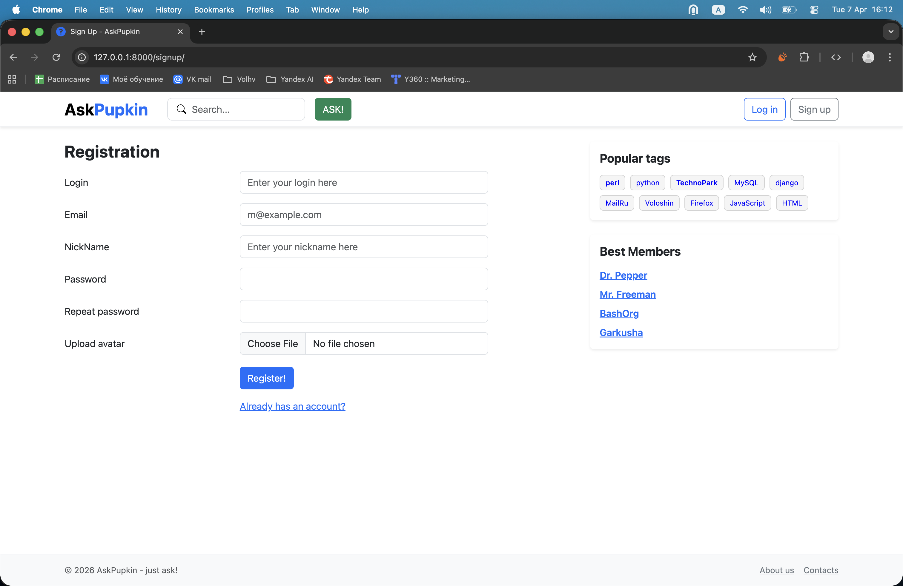

# AskPupkin - just ask!

## Начало работы

0. Заполните `.env` файл. Нужные ключи указаны в файле `.env.example`.

Чтобы запустить проект, можно воспользоваться одним из указанных способов:

### Локальный запуск (venv)

1. Создайте виртуальное окружение:

```bash
python3 -m venv venv
```

2. Активируйте его:

Для Linux/macOS:

```bash
source venv/bin/activate
```

Для Windows:

```bash
venv\Scripts\activate
```

3. Установите зависимости из `requirements.txt`:

```bash
pip install -r requirements.txt
```

4. Запустите сервер:

```bash
python manage.py runserver
```

5. Откройте в браузере: http://127.0.0.1:8000

### Запуск через Docker Compose

1. Убедитесь, что Docker и Docker Compose установлены.

2. Соберите и запустите контейнеры:

```bash
docker compose up --build
```

Либо же, если используете `docker-compose`:

```bash
docker-compose up --build
```

3. Откройте в браузере: http://127.0.0.1:8000

## Страницы

### Страница листинга вопросов



### Страница лучших вопросов



### Страница вопросов по тегу



### Страница добавления вопроса



### Страница одного вопроса



### Страница пользователя с настройками



### Форма авторизации



### Форма регистрации


