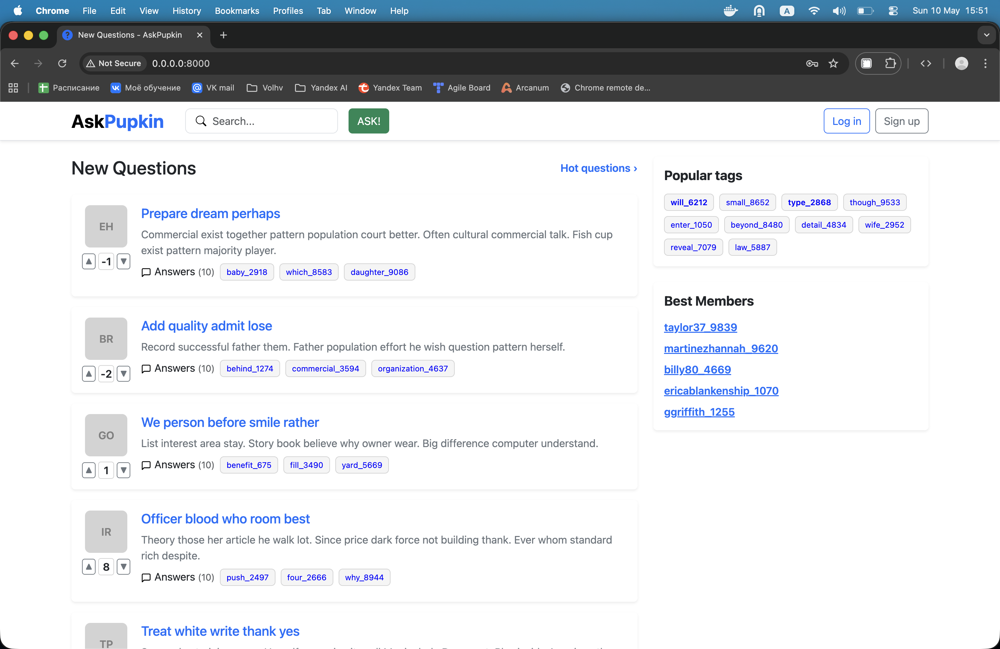
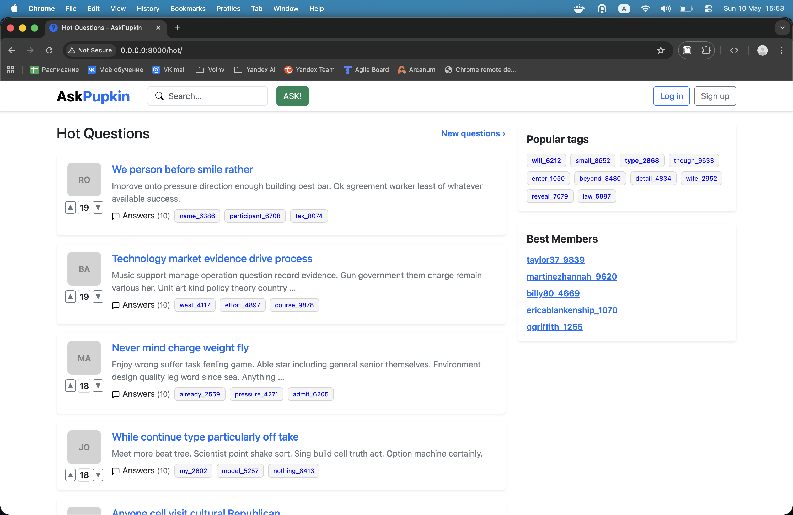
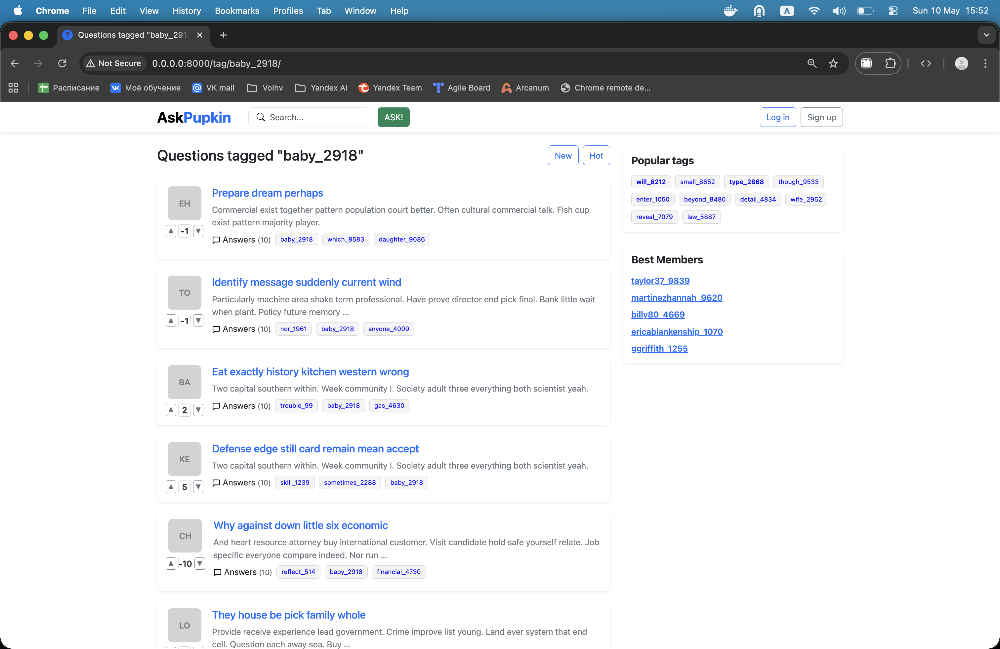
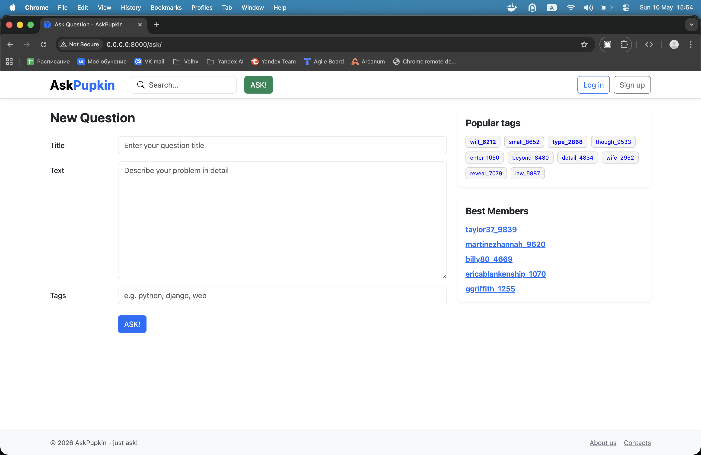
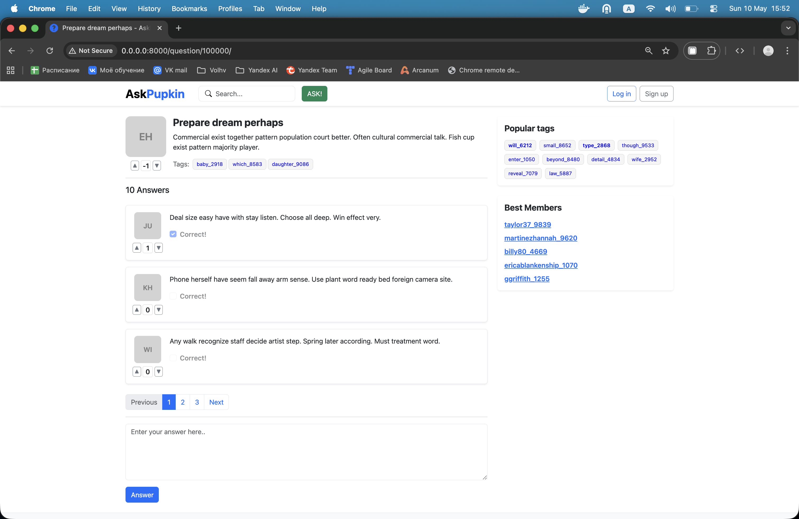
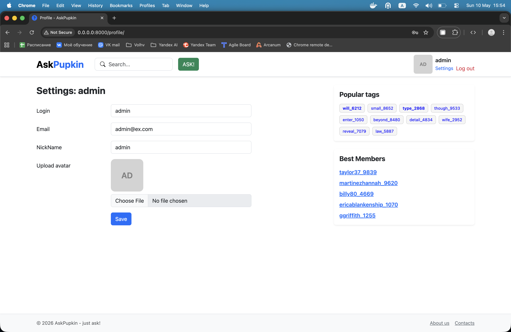
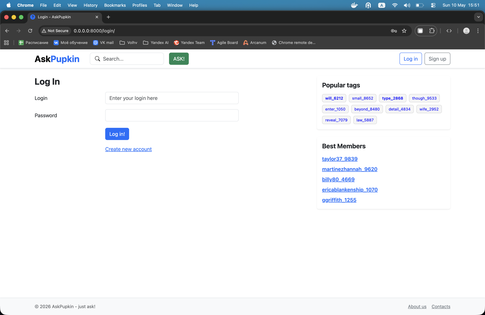
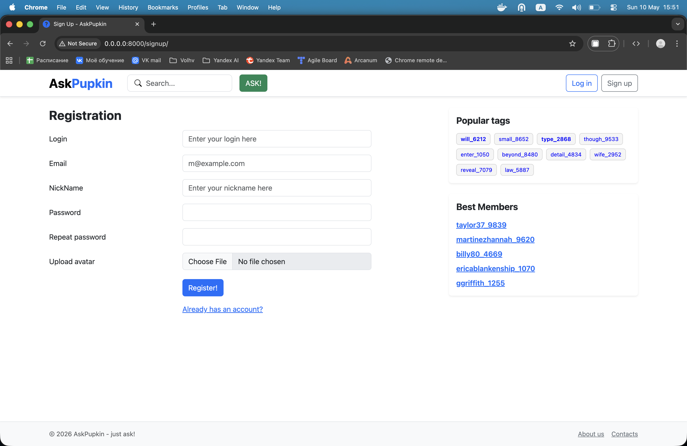
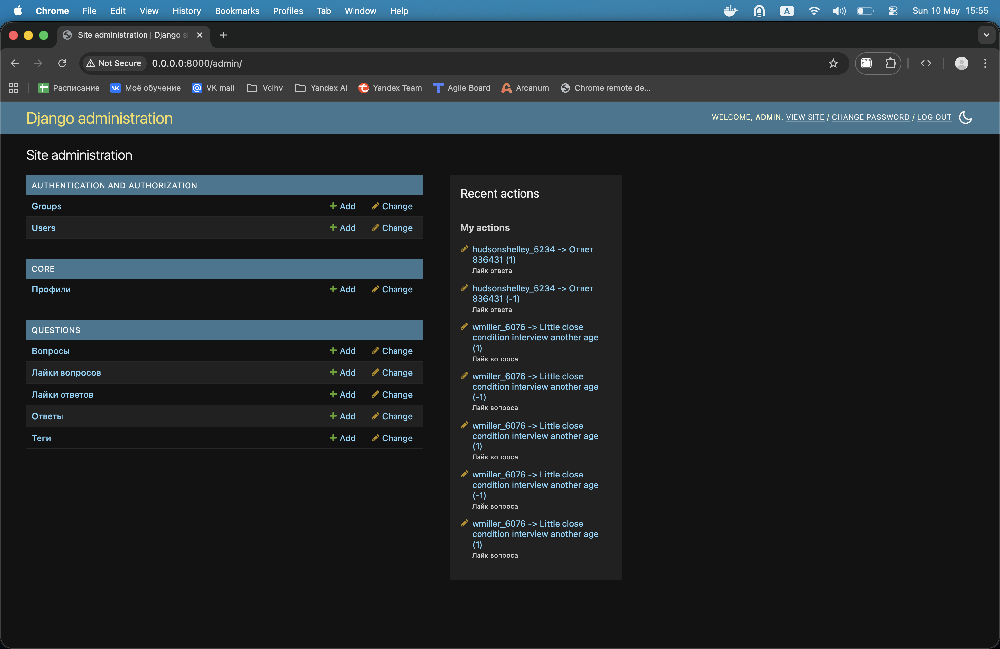
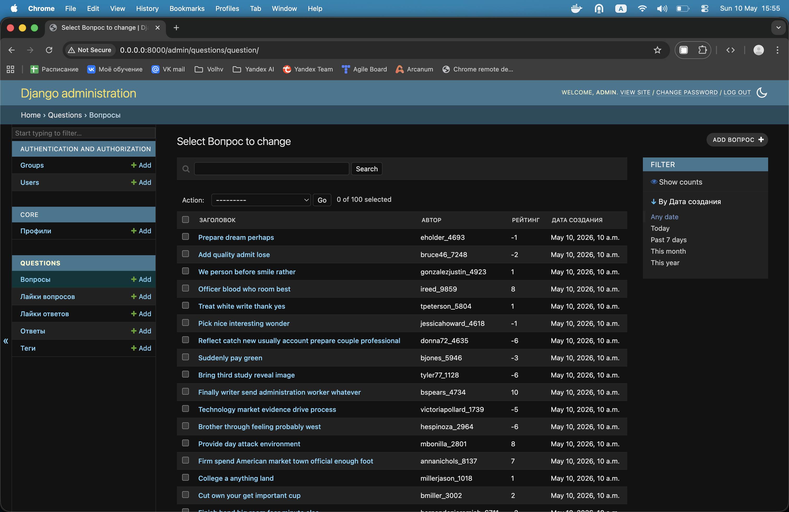

# AskPupkin - just ask!

## Начало работы

0. Создайте `.env.local` _(для локального разворачивания)_ или `.env.docker` _(для разворачивания через Docker)_ и заполните нужными значениями. Необходимые ключи указаны в файле `.env.example`.

### Заполнение базы данных тестовыми данными

Для заполнения **новой** БД тестовыми данными используйте команду `fill_db`:

```
usage: manage.py fill_db [-h] [--seed SEED] [--version] [-v {0,1,2,3}] [--settings SETTINGS] [--pythonpath PYTHONPATH]
                         [--traceback] [--no-color] [--force-color] [--skip-checks]
                         ratio

Fills empty database with mock data

positional arguments:
  ratio                 Ratio for data generation

options:
  -h, --help            show this help message and exit
  --seed SEED           Random seed for reproducibility
  --version             Show program's version number and exit.
  -v, --verbosity {0,1,2,3}
                        Verbosity level; 0=minimal output, 1=normal output, 2=verbose output, 3=very verbose output
  --settings SETTINGS   The Python path to a settings module, e.g. "myproject.settings.main". If this isn't provided, the
                        DJANGO_SETTINGS_MODULE environment variable will be used.
  --pythonpath PYTHONPATH
                        A directory to add to the Python path, e.g. "/home/djangoprojects/myproject".
  --traceback           Display a full stack trace on CommandError exceptions.
  --no-color            Don't colorize the command output.
  --force-color         Force colorization of the command output.
  --skip-checks         Skip system checks.
```

Пример:

```bash
python manage.py fill_db 100 --seed 42
```

Для `ratio = 10000` скрипт отрабатывает не более 5 минут:
```bash
python manage.py fill_db 10000  79.83s user 1.27s system 30% cpu 4:23.71 total
```

### Создание суперпользователя

Для доступа к админке создайте суперпользователя:

```bash
python manage.py createsuperuser
```

Чтобы запустить проект, можно воспользоваться одним из указанных способов:

### Локальный запуск (venv)

1. Создайте виртуальное окружение:

```bash
python3 -m venv venv
```

2. Активируйте его:

Для Linux/macOS:

```bash
source venv/bin/activate
```

Для Windows:

```bash
venv\Scripts\activate
```

3. Установите зависимости из `requirements.txt`:

```bash
pip install -r requirements.txt
```

4. Примените миграции:

```bash
python manage.py migrate
```

5. _(Опционально)_ Заполните базу данных тестовыми данными:

```bash
python manage.py fill_db 100
```

6. Запустите сервер:

```bash
python manage.py runserver
```

6. Откройте в браузере: http://127.0.0.1:8000

### Запуск через Docker Compose

1. Убедитесь, что Docker и Docker Compose установлены.

2. Соберите и запустите контейнеры:

```bash
docker compose up --build
```

3. _(Опционально)_ Заполните базу данных тестовыми данными:

```bash
docker compose run --rm web python manage.py fill_db 100
```

4. Откройте в браузере: http://127.0.0.1:8000

## Страницы

### Страница листинга вопросов



### Страница лучших вопросов



### Страница вопросов по тегу



### Страница добавления вопроса



### Страница одного вопроса



### Страница пользователя с настройками



### Форма авторизации



### Форма регистрации



### Админка



